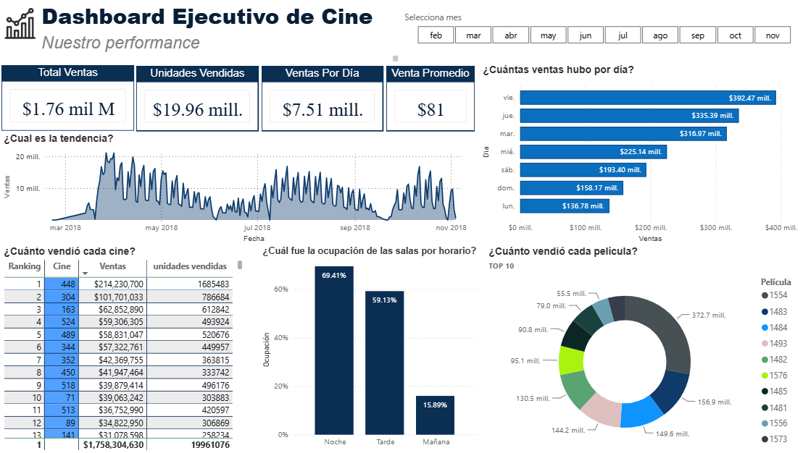
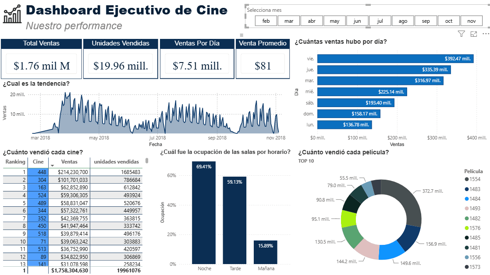

# Cinema Sales Analytics

Proyecto de análisis de datos e inteligencia de negocios enfocado en el desempeño operativo de complejos cinematográficos.  
El objetivo es transformar datos de ventas en insights accionables mediante Python y Power BI.

---

## Resumen del proyecto

Este proyecto analiza el comportamiento de ventas, ocupación y rendimiento operativo de distintos cines a lo largo del tiempo.

Se utilizan técnicas de limpieza de datos, análisis exploratorio (EDA) y visualización en Power BI para identificar patrones de consumo y optimizar la toma de decisiones.

---

## Objetivo

Desarrollar un proyecto de análisis de datos e inteligencia de negocios utilizando Python y Power BI, con el objetivo de transformar datos de ventas de cines en insights accionables.

El proyecto incluye un proceso end-to-end de análisis:

- Limpieza y transformación de datos con Python
- Análisis exploratorio (EDA) para identificar patrones de comportamiento
- Visualización y monitoreo de KPIs en un dashboard de Power BI

El propósito es:

- Analizar ingresos por cine y película
- Identificar patrones de ventas por día y mes
- Detectar horarios y periodos de mayor demanda
- Optimizar la toma de decisiones operativas basadas en datos

---

## Preguntas de negocio

- ¿Qué cines generan mayores ingresos?
- ¿Qué películas tienen mejor desempeño?
- ¿Qué días de la semana son más rentables?
- ¿Existen patrones de estacionalidad en las ventas?
- ¿Cómo varía la ocupación de las salas?
- ¿Qué relación existe entre precio del ticket y ventas?

---

## Procesamiento de datos

Se realizó un proceso de limpieza y transformación de datos que incluyó:

### Limpieza de datos
- Eliminación de valores nulos en variables críticas
- Validación de consistencia en registros
- Conversión de valores tipo date 

### Validación de integridad de datos
Se verificó la coherencia entre ventas reportadas y ventas calculadas

---

## EDA (Exploratory Data Analysis)

Se realizó un análisis exploratorio de los datos (EDA) con el objetivo de identificar insights de comportamiento en las ventas, ocupación y rendimiento operativo de los cines.

### Análisis temporal
- Se identificaron patrones de estacionalidad en las ventas por mes y por día de la semana.
- Se observó que ciertos meses presentan mayor volumen de ventas, indicando posibles periodos de alta demanda.
- El análisis diario mostró variaciones significativas en el comportamiento de ventas a lo largo del tiempo.

### Análisis de desempeño
- Se analizaron los ingresos por cine, identificando diferencias significativas entre complejos.
- Se evaluó el rendimiento de las películas en función de sus ingresos totales.

### Ocupación de salas
- Se estudió la variación de la ocupación promedio por mes.
- Se identificaron cambios en la eficiencia de uso de las salas a lo largo del periodo analizado.

### Relación entre variables
- Se analizó la relación entre el precio del ticket y las ventas totales.
- Se exploró la distribución de ventas por rangos de precio.

### Hallazgos importantes
- Se detectaron diferencias significativas en el rendimiento entre cines y películas.
- Se identificaron patrones de demanda relacionados con el tiempo (meses y días).
- Se observa una variación en las ventas promedio según rangos de precio del ticket. Sin embargo, esta relación no implica causalidad directa, ya que puede estar influenciada por otros factores como la demanda de películas o el tamaño del cine.

El EDA permitió establecer una base sólida para la construcción del dashboard en Power BI.

---
## Power BI Dashboard

Se desarrolló un dashboard interactivo en Power BI para monitorear el desempeño de los complejos cinematográficos y facilitar la toma de decisiones basada en datos.

### KPIs principales
- Ventas totales
- Tickets vendidos
- Venta promedio
- Ventas por día

### Visualizaciones
- Tendencia de ventas por día
- Comparativo de ventas por cine e ingresos
- Comparativo de películas por ingresos
- Ocupación de salas por periodo

### Objetivo del dashboard

Permitir identificar patrones de demanda, comparar el desempeño de complejos y películas, y monitorear indicadores clave del negocio mediante una interfaz interactiva.

## Vista del Dashboard

### Vista estática

### Demo interactiva
Este GIF muestra la interacción del dashboard (filtros, navegación y análisis dinámico):

## Herramientas utilizadas

- Python (Pandas, NumPy, Seaborn, Pyarrow, Matplotlib)
- Jupyter Notebook
- Power BI

---

### Estado actual

- Data Cleaning ✔
- Feature Engineering ✔
- Data Validation ✔
- Power BI Dashboard ✔

## Dataset

Fuente: Kaggle - Cinema Tickets

